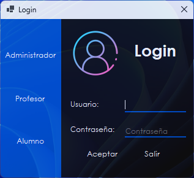
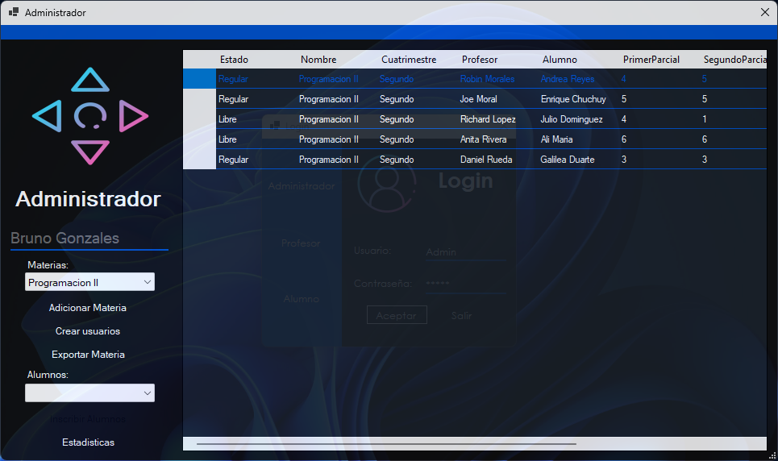
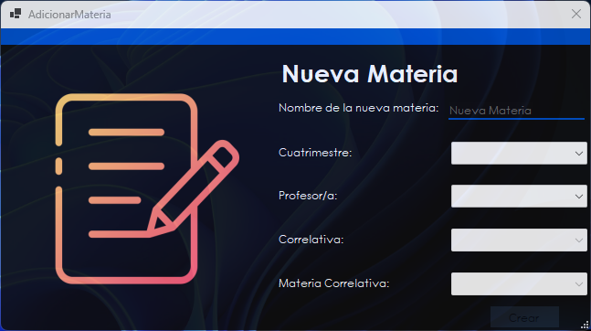
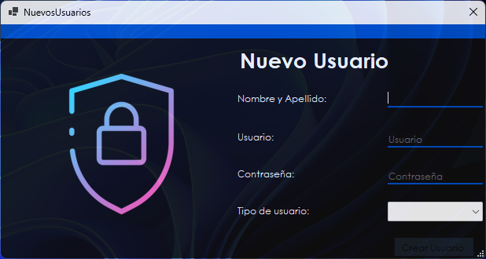
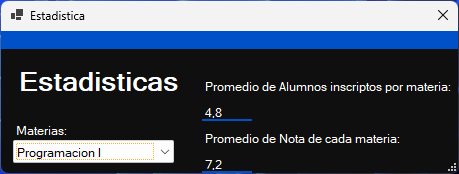
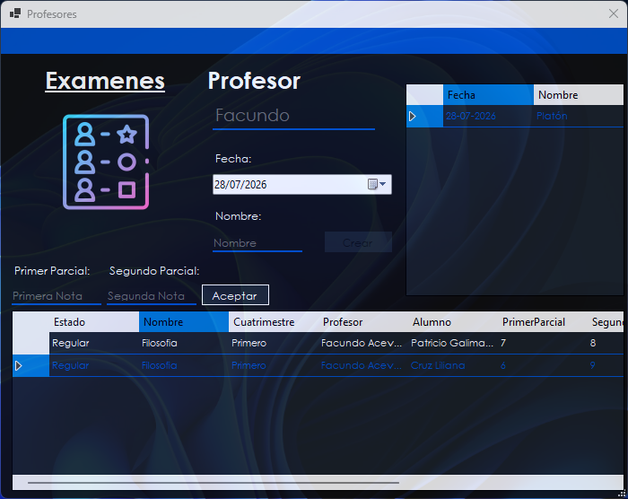
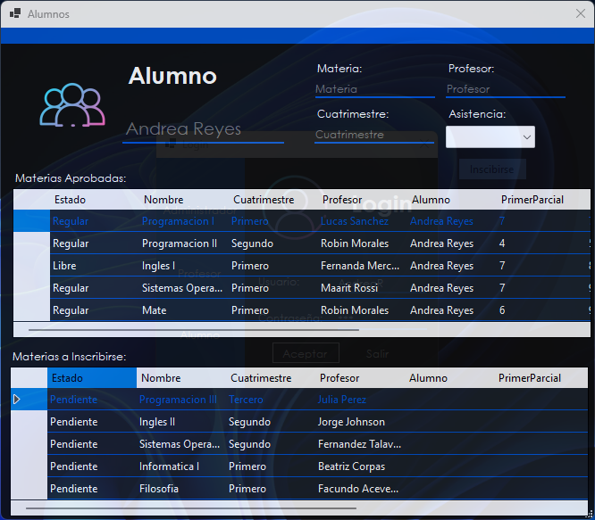

# 📚 Sistema Escolar

Sistema de gestión escolar desarrollado en **C#**, **Windows Forms** y **SQL Server** como proyecto universitario.

El objetivo del sistema es facilitar la administración de una institución educativa mediante distintos perfiles de usuario, permitiendo gestionar materias, profesores, alumnos, calificaciones y estadísticas desde una única aplicación.

---

# 🛠 Tecnologías utilizadas

- C#
- .NET Framework
- Windows Forms
- SQL Server
- ADO.NET
- Programación Orientada a Objetos (POO)
- Exportación de datos a Excel

---

# 🚀 Funcionalidades principales

- 🔐 Inicio de sesión con distintos tipos de usuarios.
- 👨‍💼 Administración de materias.
- 👨‍🏫 Gestión de profesores.
- 🎓 Gestión de alumnos.
- 📝 Registro de exámenes y calificaciones.
- 📊 Estadísticas por materia.
- 📄 Exportación de materias a Excel.
- 💾 Persistencia de datos mediante SQL Server.

---

# 📸 Capturas

## Login

Permite iniciar sesión como **Administrador**, **Profesor** o **Alumno**.

Los botones laterales autocompletan usuarios de prueba para facilitar la demostración del sistema.



---

## Panel de Administrador

Desde esta ventana el administrador puede visualizar todas las materias registradas junto con:

- Estado
- Nombre
- Cuatrimestre
- Profesor asignado
- Alumno
- Primer parcial
- Segundo parcial
- Promedio
- Correlatividad
- Asistencia

Además puede administrar las materias, crear usuarios, exportar información y consultar estadísticas.



---

## Nueva Materia

Permite registrar nuevas materias indicando:

- Nombre
- Cuatrimestre
- Profesor asignado

Si la materia pertenece al segundo o tercer cuatrimestre también es posible seleccionar:

- Correlatividad
- Materia correlativa

Una vez completados los datos, la materia queda registrada en la base de datos.



---

## Nuevo Usuario

Permite crear nuevos usuarios para el sistema.

Los tipos disponibles son:

- Administrador
- Profesor
- Alumno

Cada usuario queda almacenado en la base de datos para poder iniciar sesión posteriormente.



---

## Estadísticas

El sistema permite visualizar estadísticas por materia, mostrando información como:

- Promedio de alumnos inscriptos.
- Promedio de notas de la materia.



---

## Panel del Profesor

Cada profesor visualiza únicamente las materias que tiene asignadas.

Desde esta ventana puede:

- Crear un nuevo examen.
- Definir la fecha del examen.
- Asignar un nombre al examen.
- Visualizar los alumnos inscriptos.
- Registrar la nota del primer parcial.
- Registrar la nota del segundo parcial.
- Actualizar automáticamente el promedio del alumno.

La lista superior muestra los exámenes creados durante la sesión para facilitar el seguimiento de las evaluaciones.



---

## Panel del Alumno

El alumno dispone de dos tablas principales.

### Materias cursadas

Permite visualizar:

- Estado
- Nombre
- Cuatrimestre
- Profesor
- Primer parcial
- Segundo parcial
- Promedio
- Correlatividad
- Asistencia

### Inscripción a materias

El alumno puede seleccionar una materia disponible para inscribirse.

Al hacerlo, el sistema muestra:

- Materia
- Profesor
- Cuatrimestre
- Asistencia

Finalmente puede completar la inscripción desde la misma ventana.



---

# 🗄 Base de datos

Toda la información del sistema se almacena en **SQL Server**.

Entre los datos persistidos se encuentran:

- Usuarios
- Profesores
- Alumnos
- Materias
- Inscripciones
- Calificaciones

El repositorio incluye el script SQL necesario para crear la base de datos.

---

# ⚙ Instalación

1. Clonar el repositorio.

```bash
git clone https://github.com/IHaruI/Sistema-Escolar.git
```

2. Abrir la solución en **Visual Studio 2022**.

3. Restaurar la base de datos ejecutando el archivo:

```
2do_Parcial_Scripts.sql
```

4. Configurar la cadena de conexión a SQL Server si fuese necesario.

5. Ejecutar el proyecto.

---

# 📂 Estructura del proyecto

```
Sistema-Escolar
│
├── Biblioteca
├── Parcial_y_TP
├── Test
├── imagenes
├── 2do_Parcial_Scripts.sql
├── Patricio_Galimany_2°E.sln
└── README.md
```

---

# 🎯 Objetivos del proyecto

Este proyecto fue desarrollado con el objetivo de aplicar conocimientos sobre:

- Programación Orientada a Objetos.
- Arquitectura en capas.
- Manejo de bases de datos SQL Server.
- Windows Forms.
- ADO.NET.
- Gestión de usuarios mediante roles.
- Desarrollo de interfaces de escritorio.

---

# 📄 Licencia

Proyecto desarrollado con fines académicos.